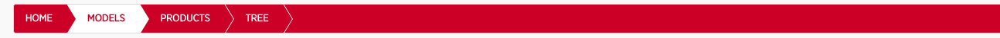
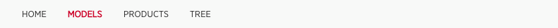

# navbar-menu

This is a navbar directive to navigate your app tabs.




## Installation

Copy the  `navbar-menu` folder in your components folder (Exemple: `angular`).

The `javascript` is automatically required by you application.js (in rails).

Declare a dependency on the module.

```js
angular.module('myModule', ['navbar-menu']);
```
Insert the HTML in your html template:
```html
<navbar-menu tabs="homeCtrl.tabs" current-state="homeCtrl.rootStateName"/>
```

In your controller define the tabs like this
```js
homeCtrl.tabs = [
  { title:'Home', url:'home.welcome' },
  { title:'Models', url:'home.models.all' },
  { title:'Products', url:'home.products.all' },
  { title:'Tree', url:'home.tree' },
];

$rootScope.$on("$stateChangeStart", function(event, toState, toParams, fromState, fromParams) {
  homeCtrl.rootStateName = toState.name;
});
```


The `scss` should be imported in your main.scss file.

Choose between :

```css
@import "angular/navbar-menu/style/navbar-menu-1";
```
Or

```css
@import "angular/navbar-menu/style/navbar-menu-2";
```


## Design

You will have to edit your scss file to define the `$primary_color`.

```css
$primary_color-navbar : $primary_color;
$hover_color-navbar : $red_2;
```
